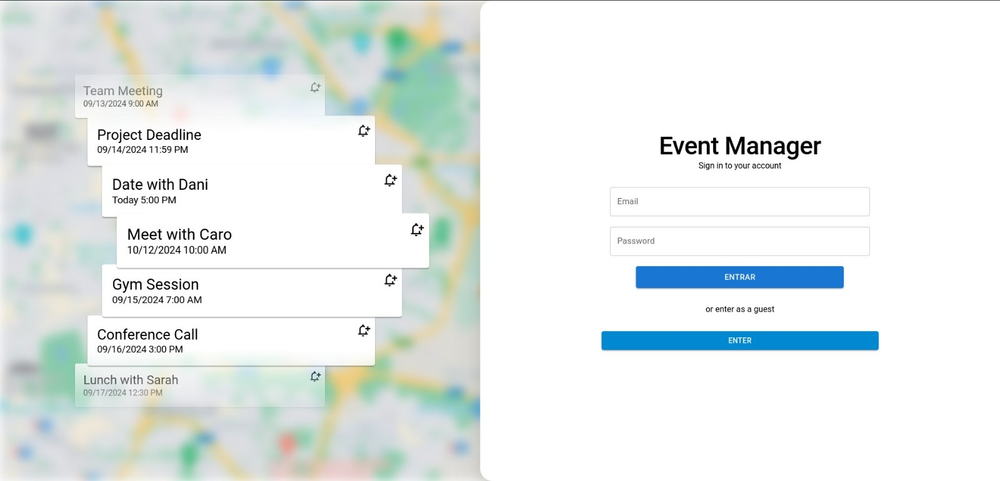

# Event Manager

### Application for event management



This is a project made purely with rsbuild,
to run it, below are the instructions,

First, install dependencies

```bash
npm install
```

If you want to see the ui component library, run:

```bash
npm run storybook
```

For start the dev server:

```bash
npm run dev
```

For build the app for production:

```bash
npm run build
```

Preview the production build locally:

```bash
npm run preview
```
